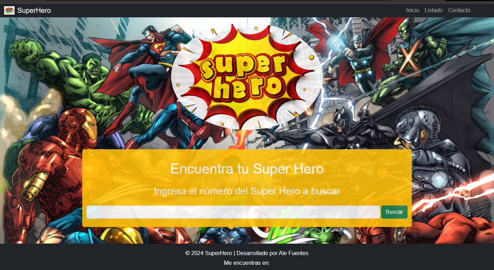
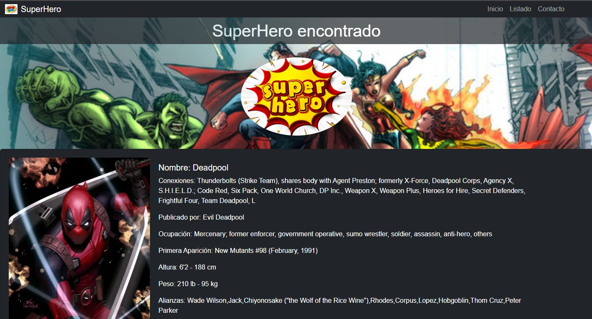
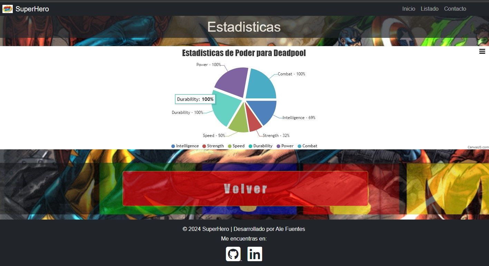
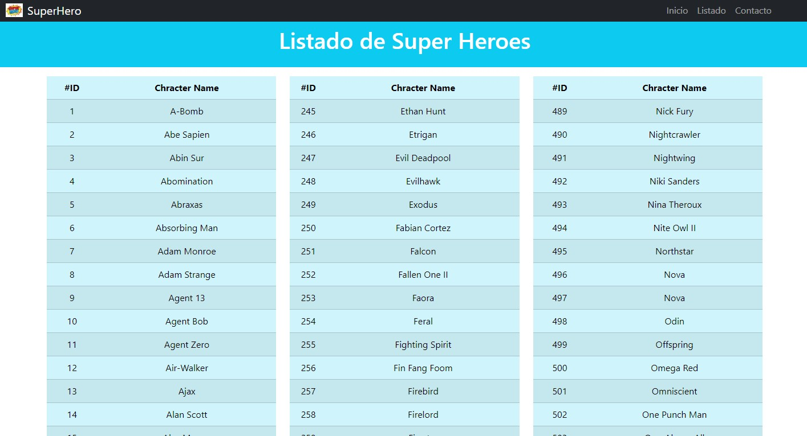

Proyecto académico Desafio Latam, "Prueba modulo #3 fundamentos de programación en JavaScript". 

Página web revista SuperHero.

Desarrollo de página web responsiva utilizando el siguiente stack: Html, Js, bootstrap, jQuery, Ajax, CanvasJS

Descripcion:
Pagina Web que utiliza un módulo de busqueda con validaciones para acceder a datos de API https://www.superheroapi.com/, 
en donde luego de obtenida la información se procesa y se muestran caracteristicas, imagen y un grafico de powerstat del super heroe utilizando CanvasJS.

link github pages: https://alefuentes982.github.io/SuperHero_JS
  
 
 
 
 

